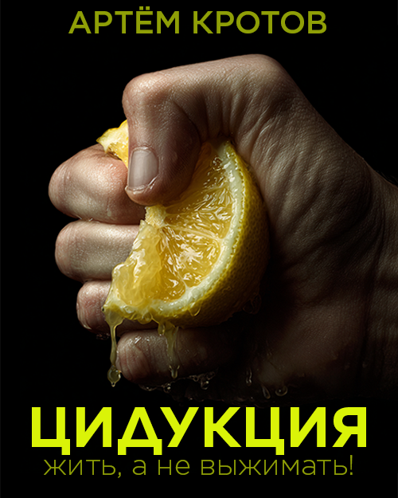

# Книга "Цидукция. Жить, а не выжимать!"

Автор Артём Кротов

- [Предисловие](foreword.md)
- [Что такое продуктивность?](productivity.md)
- [Что такое видение?](vision.md)
- [Какие препятствия на пути?](thinking-slow-and-fast.md)
- [Как открыться новым навыкам и знаниям?](open-mind.md)
- [Почему важно брать ответственность за свое развитие?](obligation.md)
- [Как перестать беспокоиться?](stop-worrying.md)
- [Список задач: Как ничего не забыть?](to-do-list.md)
- [Эффект Зейгарник: Почему нам нравится выполнять задачи?](effect-zeigarnik.md)
- [Матрица Эйзенхауэра: Как классифицировать задачи?](eisenhower-matrix.md)
- [Пари Паскаля: Как принимать сложные решения?](paskal.md)
- [Критериальный анализ: Как делать сложный выбор?](criteria-analysis.md)
- [Поллинг: Как работать с асинхронными зависимостями?](async.md)
- [Календарь: Как работать с расписанием?](calendar.md)
- [Опоздания: Как перестать это делать?](not-late.md)
- [Муда: Какие существуют потери?](muda.md)
- [Хронофаги: Кто пожирает наше время?](chronophages.md)
- [Социальные сети: Как не поддаться FOMO?](social-networks.md)
- [Уведомления и пуши: Как не стать их рабом?](disable-pushes.md)
- [Электронная почта: Как не утонуть в письмах?](email.md)
- [Рабочее место: Как создать идеально пространство?](workspace.md)
- [Фасилитация: Как планировать и проводить эффективные встречи?](facilitation.md)
- [Атомные привычки: Как подружиться со своей обезьяной?](habbits.md)
- [Как оптимизировать процессы?](process.md)
- [Как распределить время по ценности?](valuable-time.md)
- [Soft skills: Как развивать "мягкие" навыки?](soft-skills.md)
- [Обучение: Как приобретать новые знания?](learning.md)
- [Ежедневная рутина: Как использовать это время?](daily-routine.md)
- [Программирование и ИИ: Почему вам стоить попробовать?](programming.md)
- [Автоматизация: Что и как можно автоматизировать?](automation.md)
- [Какими инструментами я пользовался при написании этой книги?](book-writing.md)
- [Заключение](conclusion.md)

👉 Читать бесплатно: [Литрес](https://www.litres.ru/book/artem-krotov/cidukciya-zhit-a-ne-vyzhimat-72794674/) | [MyBook](https://mybook.ru/author/artyom-krotov/cidukciya-zhit-a-ne-vyzhimat/).

👉 Смотреть и слушать бесплатно на канале Неогенда [TG](https://t.me/neogenda) | [MAX](https://max.ru/channel_neogenda):

- Выпуск 1 - [ВКВидео](https://vkvideo.ru/video-210997384_456240380) | [RuTube](https://rutube.ru/video/11dbbb77d1b884c80c144033bb3e1f2a/)
- Выпуск 2 - TBD
- Выпуск 3 - TBD
- Выпуск 4 - TBD
- Выпуск 5 - TBD
- Выпуск 6 - TBD

👉 Связаться с автором: [timmson666@mail.ru](mailto:timmson666@mail.ru).

[Creative Commons Attribution 4.0 International License][cc-by].

[![CC BY 4.0][cc-by-image]][cc-by]

[cc-by]: LICENSE
[cc-by-image]: https://i.creativecommons.org/l/by/4.0/88x31.png
